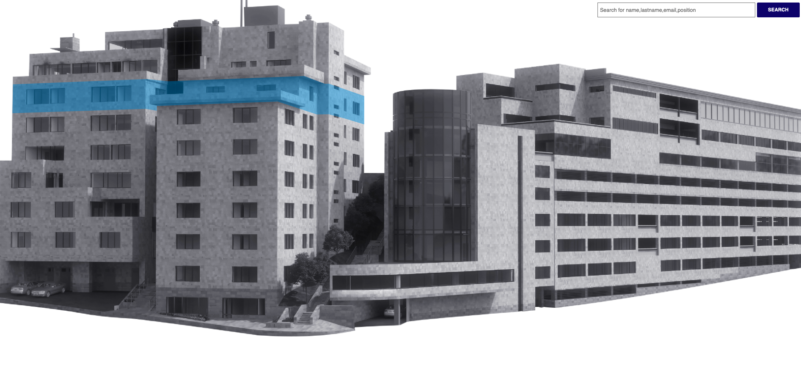
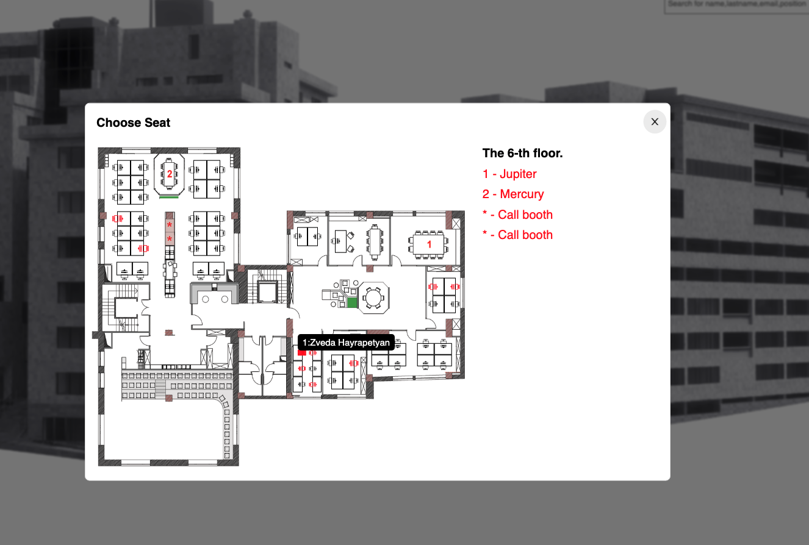
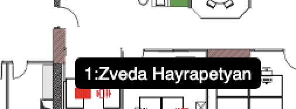
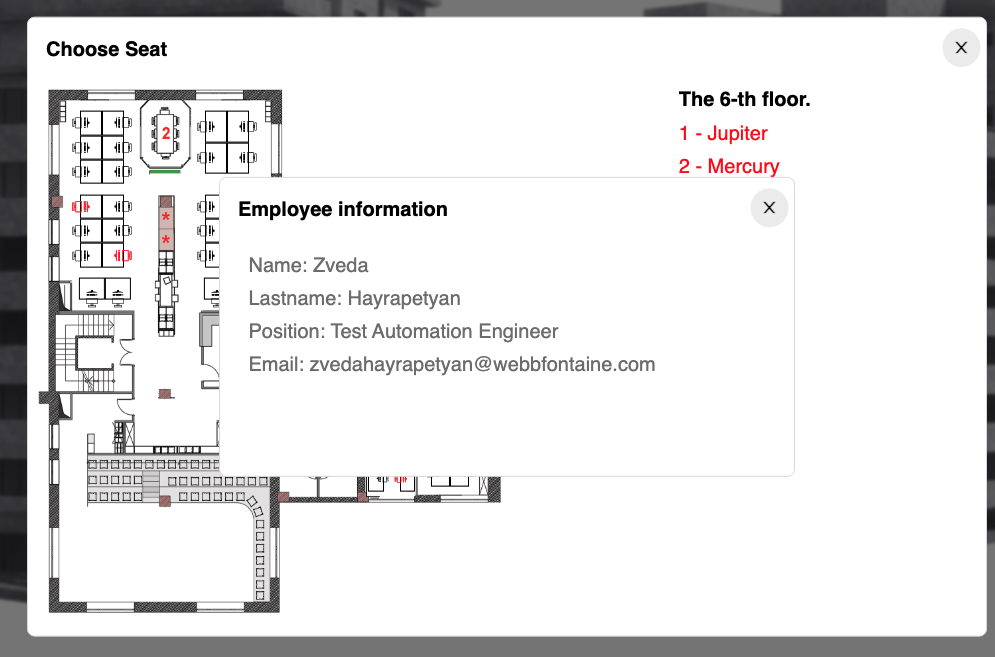
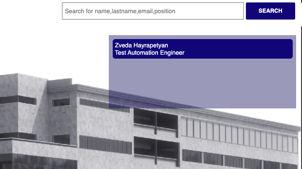
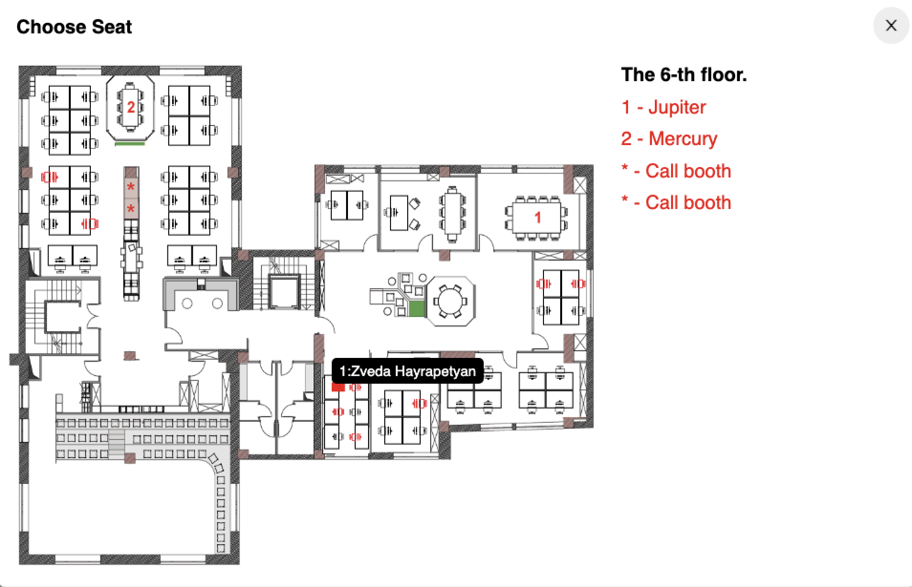

# SeatMapApp

## Used tools : 

- Postgres
- Spring Boot Framework 
- Spring Data JPA library 
- Spring Security 
- JavaScript,HTML,CSS

The seat map application should show the number of employee seats and the floor.
- When user open application should see the image of building. 

- Click on the floor, the floor map should open 

- All seats are shown in the picture, and occupied seats are marked in red 

- Hover over the seat image and see who is sitting there

- Click on the seat image to view more information about the employee

- In the upper right corner of the image we have a search bar 

- Search for an employee using first name, last name, position, email 

- By clicking on the search results, the user will see the specific residence(seat) of the employee

# Thank you ^_^